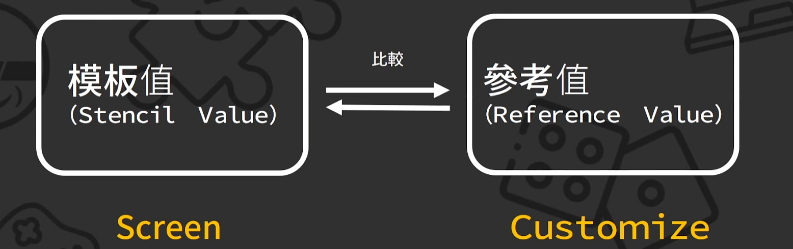

# 模板测试

Buffer(缓存)


当看到当前帧的时候，下一帧的画面会渲染到buffer中


## Stencil Buffer模板缓存



> 为什么不用ShaderGraph？

因为这里需要改渲染管线，只能用Shader

## 需要的模型：


加上两片Quad


## Shader

1. 新建一个Unlit Shader

代码如下：

```glsl
Shader "Unlit/StencilShader"
{
    Properties
    {
        //参考值
        [IntRange]_index("stencil index",Range(0,255)) = 0
    }
    SubShader
    {
        Tags
        {
            //不透明材质
            "RenderType" = "Opaque"
            //渲染队列：几何物体
            "Queue" = "Geometry"
            //渲染管线：URP
            "RenderPipeLine" = "UniversalPipeline"
        }


        Pass
        {
            //混合模式：来源和目标的透明度Alpha直接混合
            Blend Zero One
            //关闭深度写入
            ZWrite Off

            //开启模板测试
            Stencil
            {
                //参考值 index
                Ref [_index]
                //参考值和当前值比较，永远通过
                Comp Always
                //通过后，用参考值替换模板值
                Pass Replace
                //失败后，当前值不变
                Fail Keep
            }
            
        }
    }
}

```


1. 新建2个材质Material：st1、st2，勾选Unlit Shader


然后分别添加到Quad1和2

3. 为两个物体分别建Layer


4. URP里的Filtering，反勾选这两个Layer


新建Render Objects


效果如下：


